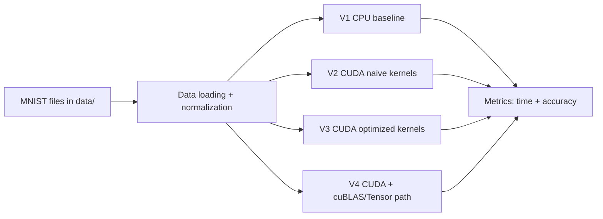

# Neural Network Optimization Using CUDA

[](#build-and-run)
[](#license)

Recruiter-facing showcase of GPU performance engineering for MNIST classification.  
This repository compares a CPU baseline against multiple CUDA implementations and documents how kernel/memory decisions affect speed and model quality.

## Problem Statement

Training and inference for dense neural networks can be bottlenecked by repeated matrix operations and memory movement on CPU.  
This project explores **how far we can push throughput and end-to-end time** by progressively optimizing the same workload:

- **V1**: Sequential CPU baseline (`v1.c`)
- **V2**: Naive CUDA kernels (`v2.cu`)
- **V3**: CUDA optimized path (`v3.cu`) with tuned launch config + improved softmax + pinned memory setup
- **V4**: cuBLAS/Tensor-Core-oriented path (`v4.cu`) using GEMM acceleration

## Why CUDA Was Used

CUDA enables massive data-parallel execution for the core operations used in this network:

- matrix multiplication in forward/backward propagation
- activation and gradient kernels
- batched per-sample compute loops

The project’s goal is to quantify GPU speedup and explain optimization trade-offs (performance vs. numerical behavior/accuracy).

## Technical Highlights

- Custom CUDA kernels: `matrixMulKernel`, `reluKernel`, `softmaxKernel`, gradient and update kernels
- Progressive optimization from naive kernels to optimized launch configuration
- Shared-memory reduction strategy in softmax (V3/V4 implementations)
- Pinned host memory (`cudaMallocHost`) in optimized paths to reduce transfer overhead
- cuBLAS integration in V4 (`cublasCreate`, GEMM path, bias-add kernel)
- Timing/profiling instrumentation:
  - CPU timing with `clock()`
  - GPU timing with CUDA events (`cudaEventElapsedTime`)
  - CPU profiling support in Makefile via `gprof` (+ optional call-graph generation)

## Architecture (High-Level)



Detailed diagram notes: [`docs/architecture.md`](docs/architecture.md)

## Tech Stack & Requirements

- **Languages:** C, CUDA C/C++
- **Libraries/Tools:** CUDA Runtime, cuBLAS (V4), GCC, NVCC, GNU Make
- **Optional profiling tools:** `gprof`, Graphviz (`dot`) for call graph image generation
- **OS:** Linux (Ubuntu recommended)
- **Hardware:**
  - CPU for V1
  - NVIDIA GPU for V2/V3
  - NVIDIA Ampere+ GPU recommended for V4 Tensor-Core-focused path

## Dataset Setup

Expected files under `data/` (matching this repository’s current nested layout):

```text
data/
├── train-images-idx3-ubyte/train-images-idx3-ubyte
├── train-labels-idx1-ubyte/train-labels-idx1-ubyte
├── t10k-images-idx3-ubyte/t10k-images-idx3-ubyte
└── t10k-labels-idx1-ubyte/t10k-labels-idx1-ubyte
```

MNIST source: http://yann.lecun.com/exdb/mnist/

## Build and Run

> All commands below assume you are in repo root.

### V1 (CPU baseline via Makefile)

```bash
make -f makefile clean
make -f makefile run
```

Notes:
- `make -f makefile all` also runs profiling + graph generation and may fail if `dot` (Graphviz) is not installed.

### V2 (Naive CUDA)

```bash
nvcc -O2 -o v2.out v2.cu
./v2.out
```

### V3 (Optimized CUDA)

```bash
nvcc -O2 -o v3.out v3.cu
./v3.out
```

### V4 (cuBLAS / Tensor-Core-oriented)

```bash
nvcc -arch=sm_80 -O2 -lcublas -o v4.out v4.cu
./v4.out
```

## Reproducible Benchmarking

To benchmark speedup/latency consistently:

1. Use the same machine/GPU and close other heavy GPU jobs.
2. Run each version at least 3 times.
3. Capture reported metrics:
   - `CPU Total Time`
   - `GPU Total Time`
   - `CPU/GPU Test Accuracy`
4. Compute speedup:
   - `speedup = CPU Total Time / GPU Total Time`

Example collection commands:

```bash
./v3.out | tee v3_run.log
grep -E "CPU Total Time|GPU Total Time|Test Accuracy" v3_run.log
```

## Results (Current + Placeholder for Your Latest Runs)

| Variant | Indicative Timing Metric* | Accuracy Signal | Relative Speed |
|---|---:|---:|---:|
| V1 CPU | ~24s total training (example run) | ~97% test accuracy | 1.0x baseline |
| V2 CUDA naive | _(fill from your run)_ | _(fill from your run)_ | _(expected: limited or mixed gains)_ |
| V3 CUDA optimized | ~6.78s GPU time (historical note) | ~96.20% (historical note) | ~3.82x (historical note) |
| V4 cuBLAS/Tensor | ~5.82s GPU time (historical note) | ~91.93% (historical note) | ~4.51x (historical note) |

> Replace placeholders with fresh benchmark logs from your target hardware before sharing with recruiters.
>
> \* Timing entries above are historical values from mixed metric types (CPU total training time vs. GPU-reported time). For strict comparison, re-run all variants and report one consistent metric definition.

## Project Structure

```text
.
├── data/                               # MNIST binary datasets
├── v1.c                                # CPU baseline
├── v2.cu                               # Naive CUDA version
├── v3.cu                               # Optimized CUDA version
├── v4.cu                               # cuBLAS/Tensor-Core-focused version
├── makefile                            # CPU build + profiling targets
├── gprof2dot.py                        # Profiling visualization helper
├── docs/architecture.md                # Architecture notes
├── CONTRIBUTING.md                     # Contribution/setup guidelines
└── .github/ISSUE_TEMPLATE/             # Bug + feature templates
```

## Limitations

- No automated CI pipeline yet (manual build/run workflow)
- Benchmark variance depends on GPU model, driver, and background load
- V4 can trade accuracy for speed because of reduced-precision behavior
- Multiple experimental `.cu` files exist; primary comparison path is V1/V2/V3/V4

## Future Work

- Add GitHub Actions CI for CPU build sanity checks
- Add scripted benchmark harness for repeatable report generation
- Expand kernel profiling with Nsight Systems/Compute exports
- Improve numerical stability controls for high-throughput GPU paths

## Contributing

See [CONTRIBUTING.md](CONTRIBUTING.md) for local setup, style expectations, and benchmark/test workflow.

## License

No `LICENSE` file is currently present in this repository.  
Until a license is added, all rights are reserved by the repository owner.
