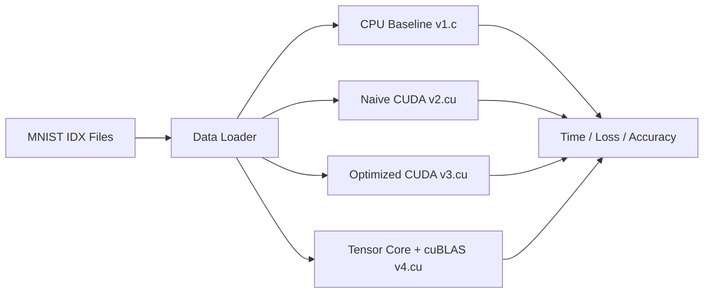

# Neural Network Optimization Using CUDA

**From CPU baseline to CUDA-optimized MNIST training: a performance-engineering project that compares naive GPU kernels, optimized kernels/streams, and Tensor Core acceleration.**

---

## Demo / Visual

> Replace this placeholder with a real run capture (e.g., `docs/assets/demo.gif`) once available.




## Overview

This repository implements and compares multiple versions of the same MNIST classifier to show how GPU optimization changes end-to-end training performance:

- **Problem:** CPU-only training becomes a bottleneck for iterative experimentation.
- **Approach:** Keep the model structure consistent and optimize execution path by path across versions.
- **What is CUDA-accelerated:** Forward/backward passes, gradient updates, softmax, and (in v4) matrix operations via cuBLAS Tensor Core paths.

Implemented variants:

1. **V1 (`v1.c`)** - CPU baseline
2. **V2 (`v2.cu`)** - Naive CUDA version for direct CPU vs GPU comparison
3. **V3 (`v3.cu`)** - Optimized CUDA (dynamic launch config, streams, pinned memory, reused buffers, parallel softmax)
4. **V4 (`v4.cu`)** - Tensor Core-accelerated path via cuBLAS TF32 on Ampere+ GPUs

## Key Features / Technical Highlights

- CUDA kernels for core NN operations (matrix multiply, ReLU, softmax, gradients, weight/bias updates)
- CPU/GPU timing instrumentation with direct speedup comparison in program output
- Batch-based training loop (`BATCH_SIZE = 64`) across all versions
- Dynamic grid/block launch parameterization (v3/v4)
- Parallel softmax with reduction strategy (v3/v4)
- Pinned host allocations to improve transfer behavior (v3/v4)
- CUDA streams to overlap transfer/computation across batches (v3/v4)
- Reused GPU buffers to reduce repeated allocations (v3/v4)
- cuBLAS GEMM with TF32/Tensor Core compute mode (v4)
- Profiling path for CPU baseline through `gprof` + call-graph generation in `makefile`

## Tech Stack / Requirements

### Hardware
- CPU for baseline (`v1.c`)
- NVIDIA GPU for CUDA versions (`v2.cu`, `v3.cu`, `v4.cu`)
- **Ampere or newer GPU recommended for v4 Tensor Core TF32 path**

### Software
- Linux environment (Ubuntu tested)
- `gcc`, `make`
- CUDA Toolkit + `nvcc`
- `cuBLAS` (for `v4.cu`)
- `python3` (for `gprof2dot.py` in profiling workflow)
- Graphviz `dot` (optional, only needed for PNG callgraph generation)

## Quickstart

### 1) Clone

```bash
git clone https://github.com/AwaisKhan-01/Neural-Netwoks-Optimization-Using-CUDA-.git
cd Neural-Netwoks-Optimization-Using-CUDA-
```

### 2) Prepare MNIST files (required path layout)

Code expects nested IDX paths like:

```text
data/
├── train-images-idx3-ubyte/train-images-idx3-ubyte
├── train-labels-idx1-ubyte/train-labels-idx1-ubyte
├── t10k-images-idx3-ubyte/t10k-images-idx3-ubyte
└── t10k-labels-idx1-ubyte/t10k-labels-idx1-ubyte
```

### 3) Build & run

#### CPU baseline (validated in this repo)

```bash
make -f makefile clean
make -f makefile run
```

#### V2 naive CUDA

```bash
nvcc -O2 -o v2 v2.cu
./v2
```

#### V3 optimized CUDA

```bash
nvcc -O2 -o v3 v3.cu
./v3
```

#### V4 Tensor Core + cuBLAS (Ampere+)

```bash
nvcc -arch=sm_80 -O2 -lcublas -o v4 v4.cu
./v4
```

## Reproducible Benchmarks

### What to measure

For each version, capture:

- CPU Total Time
- GPU Total Time (when applicable)
- Speedup
- CPU/GPU Train Accuracy
- CPU/GPU Test Accuracy
- Loss difference / accuracy difference

### Example benchmark commands

```bash
# CPU baseline
make -f makefile clean && make -f makefile run | tee logs_v1.txt

# CUDA variants
nvcc -O2 -o v2 v2.cu && ./v2 | tee logs_v2.txt
nvcc -O2 -o v3 v3.cu && ./v3 | tee logs_v3.txt
nvcc -arch=sm_80 -O2 -lcublas -o v4 v4.cu && ./v4 | tee logs_v4.txt
```

Optional CPU callgraph profiling:

```bash
make -f makefile all
# Note: this target needs Graphviz `dot` for callgraph.png generation.
```

## Results

> Do not fill this table with guessed numbers. Run the benchmark commands above and record your environment + outputs.

| Version | CPU Time (s) | GPU Time (s) | Speedup (x) | Test Accuracy (%) | Notes |
|---|---:|---:|---:|---:|---|
| V1 (`v1.c`) | TODO | N/A | N/A | TODO | CPU baseline |
| V2 (`v2.cu`) | TODO | TODO | TODO | TODO | Naive CUDA |
| V3 (`v3.cu`) | TODO | TODO | TODO | TODO | Optimized CUDA |
| V4 (`v4.cu`) | TODO | TODO | TODO | TODO | Tensor Core + cuBLAS TF32 |

## Repository Structure

```text
.
├── README.md
├── makefile
├── v1.c
├── v2.cu
├── v3.cu
├── v4.cu
├── v2_*.cu, v3_*.cu
├── nn.cu
├── data/
│   ├── train-images-idx3-ubyte/
│   ├── train-labels-idx1-ubyte/
│   ├── t10k-images-idx3-ubyte/
│   └── t10k-labels-idx1-ubyte/
├── gprof2dot.py
├── HPC-Project-Accelerating-MNIST-Classification.pdf
└── HPC_REPORT.pdf
```

## What I Learned

- Performance engineering is iterative: start with a baseline, then isolate one optimization at a time.
- Profiling-driven work is more reliable than intuition-driven tuning.
- Throughput gains come from multiple layers: launch config, memory strategy, transfer overlap, and math libraries.
- AI engineering on GPUs requires balancing speed and numerical behavior (especially with mixed/TF32 paths).

## Limitations + Future Work

- No automated benchmark harness yet (manual command execution and logging)
- Single dataset focus (MNIST); needs extension to larger workloads
- Accuracy/performance tradeoff analysis can be expanded for precision variants
- Future improvements:
  - Add scriptable benchmark runner + CSV/JSON output
  - Add Nsight Systems/Compute profiling artifacts
  - Add unit checks for kernel-level numerical parity
  - Add CI for CPU build sanity checks

## License

This repository currently does not include a license file.
If you plan to share/reuse this work publicly, add a standard open-source license (for example, MIT) in a `LICENSE` file.
