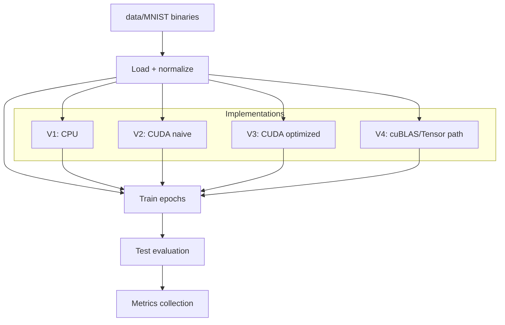

# Architecture Notes

This project compares four implementations of the same MNIST classification workflow:

1. **V1 (`v1.c`)**: CPU-only baseline
2. **V2 (`v2.cu`)**: naive CUDA kernels
3. **V3 (`v3.cu`)**: optimized CUDA kernels + launch tuning + pinned memory usage
4. **V4 (`v4.cu`)**: cuBLAS/Tensor-Core-oriented GEMM acceleration

## Data/Execution Flow

## Performance Engineering Themes

- Kernel parallelism for matrix math and activation/gradient operations
- Memory transfer overhead management (including pinned host memory in optimized paths)
- Runtime comparison of CPU vs. GPU using explicit timing instrumentation
